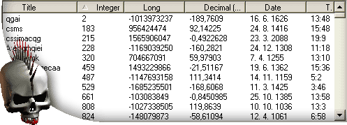



## uSc\_ListView\_Xtended\_Sort\.

### Description

[v 1.1]

You can use this class to sort ListView columns that contains numbers, dates and time.

uSc_ListView_Xtended_Sort is not very fast, but it's powerful and easy to use and customize.

Update: Now it shows sort icon on right
 
### More Info
 

             |
---                |---
**Submitted On**   |2003-06-10 09:28:58
**By**             |[uScream](https://github.com/Planet-Source-Code/PSCIndex/blob/master/ByAuthor/uscream.md)
**Level**          |Intermediate
**User Rating**    |4.8 (19 globes from 4 users)
**Compatibility**  |VB 5\.0, VB 6\.0
**Category**       |[Miscellaneous](https://github.com/Planet-Source-Code/PSCIndex/blob/master/ByCategory/miscellaneous__1-1.md)
**World**          |[Visual Basic](https://github.com/Planet-Source-Code/PSCIndex/blob/master/ByWorld/visual-basic.md)
**Archive File**   |[uSc\_ListVi1615097152003\.zip](https://github.com/Planet-Source-Code/uscream-usc-listview-xtended-sort__1-46111/archive/master.zip)

